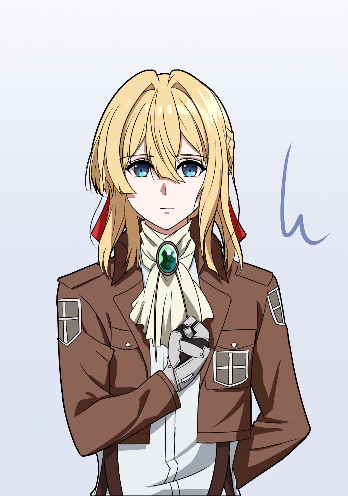
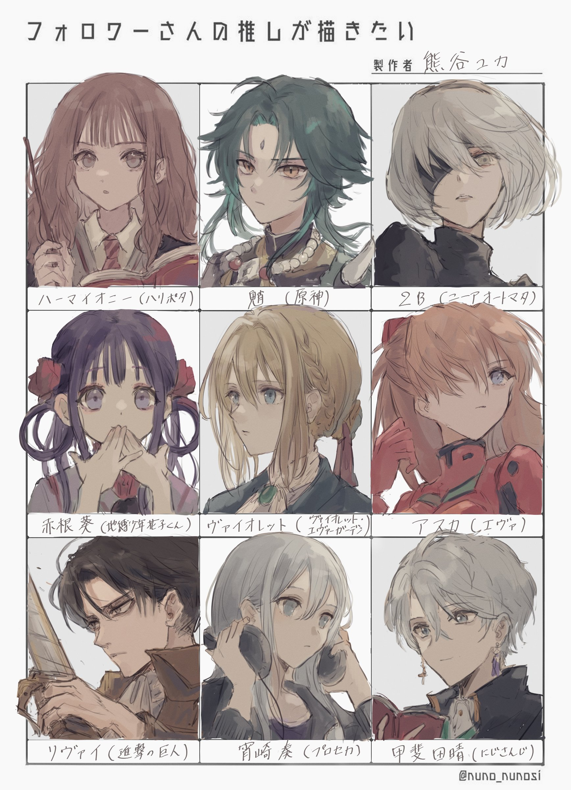

<div align="center">


```
          ✦ ˚ 　  ✦           .  *          .  *  ✦           ✦ ˚
               · ﾟ ✧    ──  Auto Memories Doll  ──    ✧ ﾟ ·
          ✦ ˚ 　  ✦           .  *          .  *  ✦           ✦ ˚
```

<a href="https://git.io/typing-svg">
  
</a>

</div>

---

<table>
<tr>
<td width="60%">

```
     ╭────────────────────────────╮
     │     🌸  𝓥𝓲𝓸𝓵𝓮𝓽  𝓔𝓿𝓮𝓻𝓰𝓪𝓻𝓭𝓮𝓷  🌸      │
     ╰────────────────────────────╯
     
     ✦  名前：  xiteral128
     ✦  好き：  Python · TypeScript
     ✦  今は：  📜 コードで手紙を書いています
     
     「伝えたい想いが、ここにある。」
```

</td>
<td width="40%">

```
     ╭─────────────────────╮
     │     🛠  Tools  🛠     │
     ╰─────────────────────╯
     
     🐍 Python      🔷 TypeScript
     💚 Vue.js       🟢 FastAPI
     🐳 Docker       🗄️  MySQL
     🔧 Git          🐧 Linux
```

</td>
</tr>
</table>

---

<div align="center">

### 📊 Stats & Languages


</div>

---

<div align="center">

### 🌸 Gallery





</div>

---

<div align="center">

### 📌 Pinned

<a href="https://github.com/xiteral128/xiaobai-ai-nav">
  
</a>

<br />
<br />

<picture>
  <source media="(prefers-color-scheme: dark)" srcset="https://raw.githubusercontent.com/xiteral128/xiteral128/output/github-contribution-grid-snake-dark.svg" />
  
</picture>

```
          ✦ ˚ 　  ✦           .  *          .  *  ✦           ✦ ˚
               · ﾟ ✧     「伝えたい想いが、ここにある。」      ✧ ﾟ ·
          ✦ ˚ 　  ✦           .  *          .  *  ✦           ✦ ˚
```

</div>
